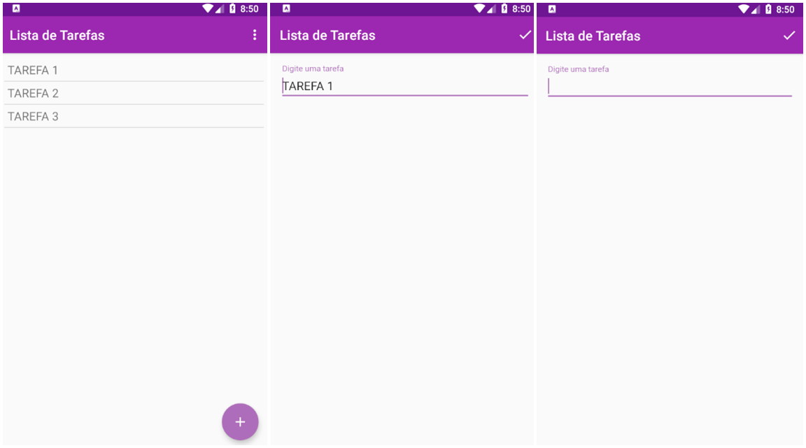

## :rocket: Lista de Tarefas - Mobile

### :art: Layout

  

----------

### :hammer_and_wrench: Ferramentas
As seguintes tecnologias foram utilizadas na construção do projeto:
- Java;
- XML;
- Banco de Dados - SQLite;
- Android Studio.

----------

###  :gear: Função
- [x] Salvar as tarefas em um banco de dados local.

----------

###  :eyeglasses: Autor
José Gustavo da Silva.
 

